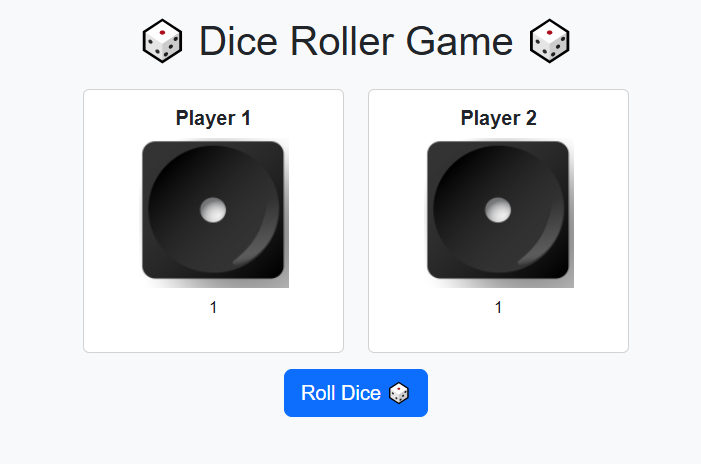

# Dice-game
🎲 Dice Roller Game is a fun web-based game built with HTML, CSS, JavaScript, and Bootstrap. Two players roll dice with real-like animations, winner highlights, badges, and confetti effects. Each round resets automatically, providing an interactive and engaging user experience.

---

## ✨ Features

* 🎲 Real‑like dice rolling animation
* 🏆 Winner badge display
* 💡 Winner card glow highlight
* 🎊 Confetti celebration effect
* 🔄 Auto reset for each new round
* 📱 Responsive design using Bootstrap

---

## 🛠️ Technologies Used

* HTML5
* CSS3
* JavaScript (Vanilla)
* Bootstrap 5

---


2. Open the project folder

3. Double‑click `index.html` or open it in your browser

---

## 📸 Screenshots



## 📁 Project Structure

```
Dice-Roller-Game/
│
├── index.html
├── style.css
├── script.js
├── images/
│   ├── dice1.png
│   ├── dice2.png
│   └── ...
├── Screenshots/
│   └── ss1.png
└── README.md
```

---

## 🙌 Future Improvements

* Sound effects
* Score counter
* Dark mode
* 3D dice animation

---

## 👩‍💻 Author

**Fakiha** – Software Engineering Student & Aspiring Full‑Stack Developer


